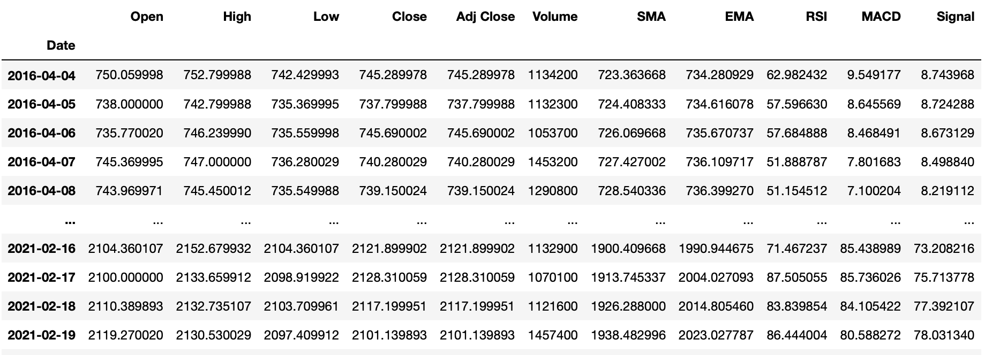
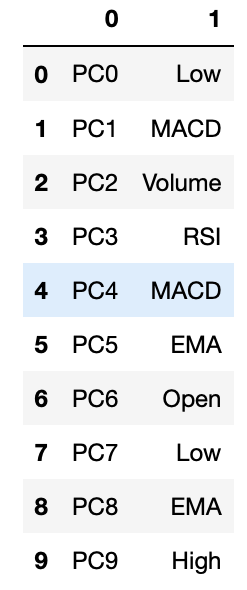
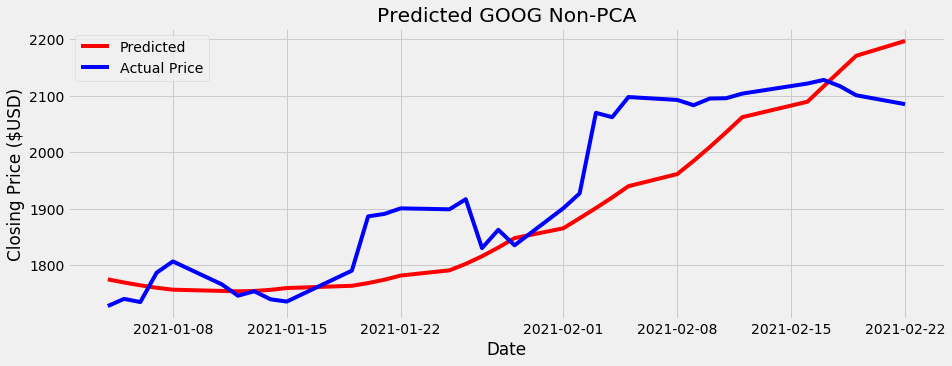
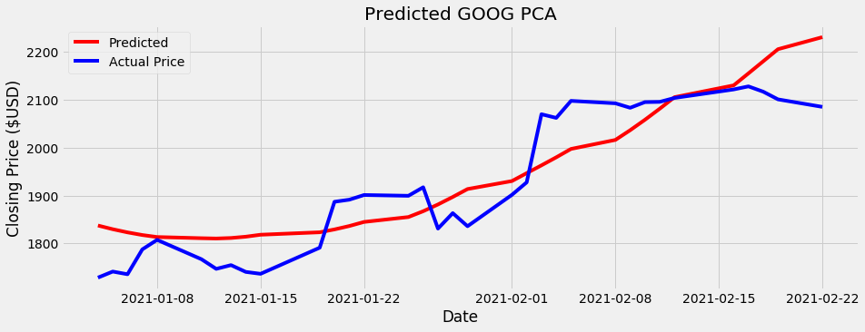
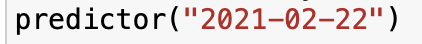
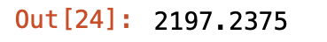

# Stock-Predictor
---
- Predicts closing price of a stock based off of historical data.
- Created a web scraper to pull historical price data from stocks through Yahoo Finance. 
- Cleaned and manipulated data using Pandas and Numpy.  
- Manually engineered several popular stock indicators such as RSI, MACD and EMA to attempt to better fit a model. 
- Implemented and optimized a Long Short Term Memory Recurrent Nueral Network using Tensorflow and Keras.
- Used Principal Component Analysis to attempt feature selection. 

## Code and Resources Used
---
- **Python Version:** 3.7
- **Packages:** pandas, numpy, sklearn, tensorflow, keras, matplotlib, io
- **Date Source:** https://finance.yahoo.com

## Web Scraping, Data Wrangling and Feature Engineering 
---
- Scraped 5 year historical Open, Closing, High, Low price data and Volume from Yahoo Finance using requests and API call.
- Converted response into list and Pandas DataFrame.
- Created SMA (Simple Moving Average), EMA (Exponential Moving Average), RSI (Relative Strength Index) and MACD (Moving Average Convergence Divergence).
- Removed NaNs.

## Principal Component Analysis 
---
- Implemented Principal Component Analysis to attempt feature selection.
- Fit SkLearn's PCA to training data. 
- Converted and sorted Principal Components in Pandas DataFrame. 

## Model Building/Performance 
---
- Used past 300 days of historial data and 301st day of "Close" pricing as X,y pair for training and test data.
- Used "Close" prices of dates after 1-1-2021 as testing data.  
- Implemented for loop to run model on data that included all features vs model that included feature selection using PCA.
- Implemented Long Short Term Memory Recurrent Nueral Network using Keras and Tensorflow.
- Used RandomSearch from Keras to optimize 'val_loss' based on 'input_units' and 'dropout'
- Used Non PCA feature selected model to predict prices in test data as it had a lower validation loss score. 
- Plotted predicted closing prices aganist actual closing prices using MatPlotLib.

## Predicted Stock Price
---
- Implemented function that takes date as input and returns predicted closing price. 

 

